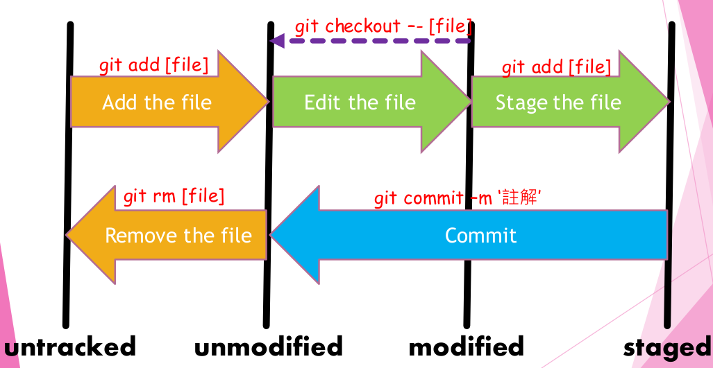

# 交作業流程

1. 先加入 GitHub classroom，讓系統建立自己的 repository。

2. 使用 CLI，`cd <path>` 切到想要放置專案的路徑下，再輸入 `git clone <url>` 指令由遠端複製專案到本地端。

3. 寫作業前，先 `git checkout -b <feature>` 開一條新分支並切換進去。

4. 開始寫作業，寫完一項可以先 `git add .` 接著 `git commit -m "commit message"`，將需要版本控制的檔案加入追蹤再提交。若檔案是 unmodified 的狀態可直接使用 `git commit -am "commit message"` 省去 `git add .` 的步驟。
   
   [圖片來源](http://wiki.csie.ncku.edu.tw/git)

5. 寫完作業後 `git status` 查看檔案狀態，確認便能使用 `git push origin <feature>` 推上遠端 repository。

6. 在 GitHub 上發 pull request，再到學習系統上的課程總覽，貼上 pull request 頁面網址繳交作業。等助教確認後 merge 到遠端的 master 分支（順便刪除遠端的 feature 分支）。

7. 確認上述步驟完成，在本地端 `git pull origin master` 將遠端 master 分支的更新同步（拉）到本地端，並刪除本地端 feature 分支。

- 可用 `git branch -v` 查看所在分支。
- 可用 `git status` 查看檔案狀態。
