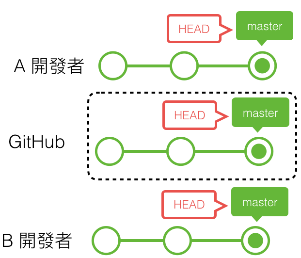

## 跟你朋友介紹 Git

### 什麼是 Git

Git 是分散式版本控制軟體。為什麼需要版本控制呢？因為發布一個軟體之後常常需要更新，如果想要同時保留原本的和更新後的版本，久了之後電腦檔案就會變的雜亂難以整理
於是為了幫助我們管理不同版本的檔案，版本控制軟體就誕生了。

### 基礎的使用

- `git init` 後隨時都可以使用 `git status` 來查看目前檔案的狀態。
- `git log` 可查看歷史紀錄。
- `git diff` 可比較現在檔案與上個版本的不同之處。

1. 先 `cd` 到你想要版本控制的專案內。

2. `git init`，初始化建立本地數據庫，實際上會建立一個 `.git` 資料夾， Git 軟體會透過它進行監視版控。因為 .git 資料夾預設是隱藏的，要透過 `ls -a` 查看。
   

3. `git add .`，將所有檔案加入追蹤——也就是叫 Git 監視它們的變化。

4. `git commit -m "commit message"`，先提交一個最初版本，讓 Git 記住你的專案一開始長這樣子。 commit message 是方便你回頭看，這個版本有做什麼改動而記錄的訊息。

5. 接下來就可以編輯檔案啦。

6. 編輯一個段落後，想要儲存變更成為一個版本，那就 `git add <file>` 跟 Git 說這些檔案的變更需要追蹤。再來 `git commit -m "commit message"` 建立更新過後的版本。覺得麻煩不想要每次都下兩個指令，那就直接 `git commit -am "commit message"` 吧！它會把之前 add 過的檔案都 commit 成新的版本。專案內沒有新檔案的話，用這個可以少打一點字。

   #### 工作目錄、預存區與資料夾

   

   檔案主要有三種狀態：

   - Modified：檔案被修改過，但還沒提交到本地端資料庫。
   - Staged：已經將修改過的檔案以 `git add <file>` 加入 staging area，等待下次提交。
   - Committed：資料已經存入本地端資料庫。

   [source](https://git-scm.com/book/en/v2/Getting-Started-What-is-Git%3F)

7. commit 完成之後，如果想要把它存在如 Github 等遠端數據庫的話，便需要多執行一些步驟，若是要從遠端複製專案到本地，使用 `git clone <url>`。

8. `git remote add origin <git_repository_url>`，新增遠端資料庫。origin 是這個遠端資料庫的「簡稱」，除此之外也能設定其他遠端資料庫。 `git remote -v` 可以列出已儲存的遠端資料庫。若當初是直接從遠端 `clone` 下來，那麼 Git 會自動幫你設定好 origin。

9. `git push origin master`，將本地數據庫目前所在的 branch，推上遠端的 master branch。

   #### A 先新增了一個 commit：

   

   #### A 將資料由本地端 push 上 GitHub：

   
   [source](https://w3c.hexschool.com/git/7b64aa34)

10. 若是跟別人協作的情況，則需要用 `git pull origin master` 將別人新提交到遠端資料庫的更新，抓下來到本地端。

    #### A 先把東西 push 上 GitHub：

    

    #### B 再把東西從 GitHub pull 下來：

    
    [source](https://w3c.hexschool.com/git/3a1a8767)
