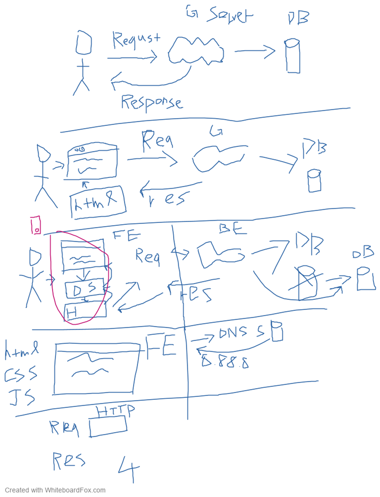

## 請解釋後端與前端的差異

進入網站時，顯示的頁面像是排版、圖片，還有簡單的互動如按鈕、動畫特效等等是由前端負責處理，主要使用的工具有 HTML、CSS、JavaScript。

後端則是負責商業邏輯與資料，例如會員註冊、登入、商品加入購物車的功能都屬於後端的範疇，通常會挑一個語言搭配上資料庫來學。

## 假設我今天去 Google 首頁搜尋框打上：JavaScript 並且按下 Enter，請說出從這一刻開始到我看到搜尋結果為止發生在背後的事情

### 借老師~~靈魂畫手~~的圖一用



使用者輸入的資料由瀏覽器，經過 OS 傳給網路卡，經過 DNS server 查到 IP 位置後，將資料以 HTTP 的格式傳（request）給 google 的 server，server 向 database 查詢資料取得結果，以 HTTP 的格式回傳（response）給使用者，瀏覽器收到之後顯示在使用者螢幕上。

## 請列舉出 3 個「課程沒有提到」的 command line 指令並且說明功用

1. clip

   ```shell
   <command> | clip
   clip < <filename>
   ```

   從命令列將命令輸出重新導向至 Windows 剪貼簿。

2. add alias

   ```shell
   add alias <aliasname> <aliasvalue>
   ```

   將別名新增至別名環境。

3. ipconfig

   ```shell
   ipconfig
   ```

   顯示所有介面卡的基本 TCP/IP 設定。
