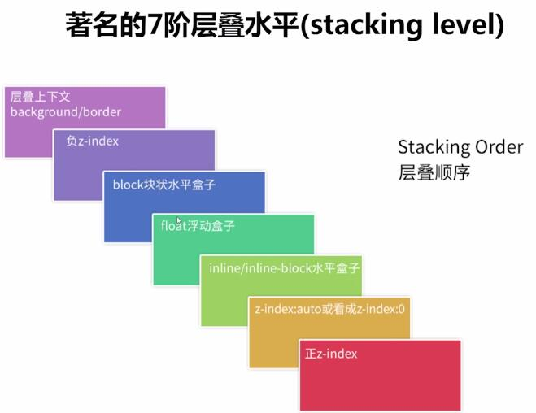

## show time - restaurant

### SCSS

```SCSS
// 變數
$btn-color: #3e613d;

// mixin
@mixin my-mixin {
  background-color: $btn-color;
  padding: 1rem;
}

.btn {
  @include my-mixin;
}

// 匯入 base 資料夾下的 reset.scss
@import "base/reset";
```

#### 檔案架構

底線開頭代表引入用的檔案，不會被直接編譯成 `.css`。

```shell
sass/
|
|– abstracts/
|   |– _variables.scss    # Sass Variables
|   |– _functions.scss    # Sass Functions
|   |– _mixins.scss       # Sass Mixins
|   |– _placeholders.scss # Sass Placeholders
|
|– base/
|   |– _reset.scss        # Reset/normalize
|   |– _typography.scss   # Typography rules
|   …                     # Etc.
|
|– components/
|   |– _buttons.scss      # Buttons
|   |– _carousel.scss     # Carousel
|   |– _cover.scss        # Cover
|   |– _dropdown.scss     # Dropdown
|   …                     # Etc.
|
|– layout/
|   |– _navigation.scss   # Navigation
|   |– _grid.scss         # Grid system
|   |– _header.scss       # Header
|   |– _footer.scss       # Footer
|   |– _sidebar.scss      # Sidebar
|   |– _forms.scss        # Forms
|   …                     # Etc.
|
|– pages/
|   |– _home.scss         # Home specific styles
|   |– _contact.scss      # Contact specific styles
|   …                     # Etc.
|
|– themes/
|   |– _theme.scss        # Default theme
|   |– _admin.scss        # Admin theme
|   …                     # Etc.
|
|– vendors/
|   |– _bootstrap.scss    # Bootstrap
|   |– _jquery-ui.scss    # jQuery UI
|   …                     # Etc.
|
`– main.scss              # Main Sass file
```
[The 7-1 Pattern](https://sass-guidelin.es/#the-7-1-pattern)

#### ref

[guideline](https://sass-guidelin.es/)  
[syntax](https://sass-lang.com/documentation/syntax)  
[David's Notes](https://yungshenglu.github.io/2017/12/26/SassNotes9/)  
[HackMD](https://hackmd.io/@yuci0213/r17cT6NiL)

### CSS 筆記

#### z-index / stacking-context



[理解網頁元素的垂直排序規則以及善用 CSS STACKING CONTEXT](https://useme.medium.com/%E7%90%86%E8%A7%A3%E7%B6%B2%E9%A0%81%E5%85%83%E7%B4%A0%E7%9A%84%E5%9E%82%E7%9B%B4%E6%8E%92%E5%BA%8F%E8%A6%8F%E5%89%87%E4%BB%A5%E5%8F%8A%E5%96%84%E7%94%A8-stacking-context-8f5c8c0f6be2)

[深入 css z-index 屬性](https://andyyou.github.io/2016/03/03/z-index/)

[MDN](https://developer.mozilla.org/en-US/docs/Web/CSS/CSS_Positioning/Understanding_z_index)

#### font-face

```SCSS
@font-face {
  // CJK Unified Ideographs
  font-family: my-font;
  src: local("Microsoft JhengHei"), local("sans-serif");
  unicode-range: U+4E00-9FFF;
}
// vietnamese
@font-face {
  font-family: my-font;
  font-style: normal;
  font-weight: 400;
  font-display: swap;
  src: url(https://fonts.gstatic.com/s/questrial/v13/QdVUSTchPBm7nuUeVf70sSFlq20.woff2) format('woff2');
  unicode-range: U+0102-0103, U+0110-0111, U+0128-0129, U+0168-0169, U+01A0-01A1, U+01AF-01B0, U+1EA0-1EF9, U+20AB;
}
```

[Unicode Character Ranges](https://www.ling.upenn.edu/courses/Spring_2003/ling538/UnicodeRanges.html)

#### 摺疊欄位

指到 title 時把文字往上移、降低 container 最大高度。

html:

```html
<h2 class="title">Title</h2>
<div class="container">
  <p>
      Lorem ipsum dolor, sit amet consectetur adipisicing elit. Rem ab harum, expedita aperiam modi, autem nam quia cumque id debitis esse optio deleniti praesentium. Est aut at dicta aliquam facere!
  </p>
</div>

```

SCSS:

```SCSS
.container {
  transition: max-height .2s ease-in;
  max-height: 30rem;
  overflow: hidden;
  
  p {
    transition: transform .2s ease-in;
    transform: translateY(0);
  }
}

.title:hover + .container {
  max-height: 0;
  
  p {
    transform: translateY(-100%);
  }
}
```

#### box shadow generagor

[box shadow generagor](https://cssgenerator.org/box-shadow-css-generator.html0)

### JavaScript

#### throttle & debounce

[throttle & debounce](https://mropengate.blogspot.com/2017/12/dom-debounce-throttle.html?fbclid=IwAR1ncL2Wn9giRB8tTurV_ipXpRppvP1bCv1kX5ibrZgrzw3_5s_DZ2G3St8)

### HTML

#### Preload, Prefetch 和 Preconnect

[Shubo 的程式教學筆記](https://shubo.io/preload-prefetch-preconnect/)

## ESLint

### 看不懂可選串聯（Optional chaining：`?.`）

1. 安裝 babel/eslint parser

   ```shell
   $ npm install eslint @babel/core @babel/eslint-parser --save-dev
   ```

2. 去 `.eslintrc` 指定 parser

  ```JavaScript
  module.exports = {
    parser: "@babel/eslint-parser",
    parserOptions: {
      requireConfigFile: false
    }
  };
  ```

[Stack Overflow: eslint - Optional chaining error with vscode](https://stackoverflow.com/questions/61628947/eslint-optional-chaining-error-with-vscode)  
[npm babel/eslint-parser](https://www.npmjs.com/package/@babel/eslint-parser)
