# 短網址系統設計

第一次接觸，查資料查得很痛苦，遞迴似的不斷開分頁查名詞。看完很多資料後還是不熟，無法從零自己設計一個系統，到處拼拼湊湊才產生這篇縫合怪。主要還是方便自己回頭複習，有點關鍵字可以查。

## 架構圖

## 過程

### Step 1: Requirements clarifications

#### Functional requirement

##### 主要功能

1. POST 一個長網址，分配一個短網址並回傳。
2. GET 一個短網址，重新導向（301、302）到長網址。

##### 其他可新增的功能

1. 統計資料（轉址要用 302。301 表示資源永久改變位置，會被搜尋引擎快取，而直接向 longURL 發送 request）。
2. 自訂 shortURL。
3. 設置密碼，有權限才能經由短網址重新導向。
4. 設定短網址在一定期限後過期。

#### Non-functional requirement

Performance, modifiability, availability, scalability, reliability, etc.

[CAP 定理](https://zh.wikipedia.org/wiki/CAP%E5%AE%9A%E7%90%86) 中，要選 AP 還是 CP？

不是非二元對立的選擇，要取捨合適的比例。如選擇要強一致性（strong consistency）或最終一致性（eventually consistency），可參考 [CAP定理101—分散式系統，有一好沒兩好](https://medium.com/%E5%BE%8C%E7%AB%AF%E6%96%B0%E6%89%8B%E6%9D%91/cap%E5%AE%9A%E7%90%86101-3fdd10e0b9a)。

在這邊選擇高可用性，最後有同步到所有資料庫就好了。

### Step 2: Estimation of important parts (Constraints)

#### traffic

假設一段時間內大約一個人需要轉換短網址，一百個人需要重新導向。寫入跟讀取的比例為 1:100。系統為 read-heavy。

若每秒有 100 個創建 URL 的請求（QPS: 100 req/s），則每秒有 10000 個重新導向的請求（QPS： 10000 req/s）。

五年就會有： $100 * 3600 * 24 * 365 * 5 =~ 15B$ 個創建短網址的請求。

#### storage

使用 A-Z、a-z、0-9 總共 62 個 character。若短網址長度為 6，總共組合有 $62^6 = 56B > 15B$，QPS 不變的話，可以保證在五年內用不完。

假設長網址為 500 個 character，對應的短網址為 6 個 character。那麼一個對應的 mapping 為 506 Bytes。五年則為 $15 * 10^9 * 506 = 7.6$TB。

### Step 3: Data Flow

#### API

先只做基本功能。input 可加入 user_key，為了讓伺服器知道使用者是誰，以防止濫用，在短時間創了一大堆短網址。

1. getURL(shortURL) => return longURL
2. postURL(longURL) => return shortURL

#### Database

1. 資料數量很多（Billion）
2. 紀錄本身很小（< 1KB）
3. 紀錄之間關聯不大（不用 join）
4. Read-heavy

[這篇](https://www.geeksforgeeks.org/system-design-url-shortening-service/) 說 NoSQL 的 scalability 比較好，不太懂詳細原因，可能還要再查。

##### schema

| shortURL（primary key） | originalURL  |
| ----------------------- | ------------ |
| varchar(6)              | varchar(512) |

### Step 4: High-level Component design

### Step 5: Detailed design

#### 產生短網址的方式（Algorithm）

##### 隨機產生

1. 產生一個短網址，檢查 DB 內有沒有，沒有的話就放入 DB。可能會有 race condition。
2. 產生一個短網址，利用 DB 內建函式，INSERT INTO ... WHERE NOT EXISTS。要資料庫有支援。
3. 產生一個短網址，存入 DB。再從 DB 那個短網址，看看長網址跟當初的是否相同。不一樣的話，產生新的短網址，隨機過一段時間再存一次。

##### 用長網址去 hash

62 進位（A-Z、a-z、0-9），長度六個 character 總共有 $62^6$ 種組合。若在 MySQL 用 Bit-Value type 來存，需要 $log_{2}{62^6} =~ 36 + 1 = 37$bits 的空間。若在 MySQL 用 CHAR 存，六個 character 則需要 6bytes。

md5 會固定輸出 128-bits 的雜湊值，取前面 37bits 轉成（encoding） 62 進位即是短網址。相同長網址會產生相同的短網址，可以省 DB 空間。若想產生不同的短網址，就把 user_key 之類的當鹽加進去，好處是可以分別統計資料。

存入 DB 時也需要像前面一樣確認有沒有重複的。

##### 用 counter 產生（range based）

推影片解說 [System Design : Design a service like TinyUrl](https://youtu.be/fMZMm_0ZhK4?t=1056)。

利用 zookeeper 這類分散式服務框架，分配給各個 application server 不同範圍的 counter，如機器 A 負責 1 ~ 1,000,000；機器 B 負責 1,000,001 ~ 2,000,000。再利用這些 counter 產生短網址即可。

可直接將 counter 轉成 62 進位，或者和長網址一起 hash 再轉成 62 進位。碰撞機率應該不高（？）存入 DB 時就可以不用先 DB call 確認有沒有重複。

##### 預先產生

先把六碼短網址生好，application server 在需要的時候向 key generating service 去拿。一次請求不用只拿一個，可以多拿一些存入 memory。

#### Replication

為避免 single point of failure，需要多台機器互相同步資料做備份。

#### Cache

read-heavy 的服務，根據 80/20 法則，快取 20% 的讀取需求就好。$100 * 100 * 3600 * 24 * 506 * 0.2 = 87.43$GB。

redis 是存在 memory 的，速度比較快，可以拿來當快取。

#### Partition

將資料分區。可以用 hash 完前面幾個字來分區，看要存在哪個 database。

## 參考資料

[System Design of URL Shortening Service](https://towardsdatascience.com/system-design-of-url-shortening-service-b325b18c8f88)、[System Design 101](https://towardsdatascience.com/system-design-101-b8f15162ef7c)：列出系統設計時的大方向，還有讚讚說明。

[System Design : Design a service like TinyUrl](https://www.youtube.com/watch?v=fMZMm_0ZhK4)：影片資源。有架構，也有講分配短網址的幾個實作方法（隨機、用 md5、counter）。

[URL shortener system design | tinyurl system design | bitly system design](https://www.youtube.com/watch?v=JQDHz72OA3c)：另一個影片資源。

[系統設計 - 設計縮網址服務](https://www.jyt0532.com/2019/12/05/design-tiny-url/)：別人的部落格，用問答的方式來說明。

[Short URL API Server 架設心得與教學](https://hackmd.io/@Xpz2MX78SomsO4mV3ejdqg/SyvmmBCfX?type=view)：別人從零開始研究的過程，以 Flask 作為 server framework，Redis 作為資料庫，uWSGI 與 Nginx 作為架站的工具。

[System Design – URL Shortening Service](https://www.geeksforgeeks.org/system-design-url-shortening-service/)

[短网址(short URL)系统的原理及其实现](https://hufangyun.com/2017/short-url/)：簡單講解，有流程圖。

[CAP定理101—分散式系統，有一好沒兩好](https://medium.com/%E5%BE%8C%E7%AB%AF%E6%96%B0%E6%89%8B%E6%9D%91/cap%E5%AE%9A%E7%90%86101-3fdd10e0b9a)

[System Design : Scalable URL shortener service like TinyURL](https://medium.com/@sandeep4.verma/system-design-scalable-url-shortener-service-like-tinyurl-106f30f23a82)

[MySQL Replication 主從式架構設定教學](https://blog.toright.com/posts/5062/mysql-replication-%E4%B8%BB%E5%BE%9E%E5%BC%8F%E6%9E%B6%E6%A7%8B%E8%A8%AD%E5%AE%9A%E6%95%99%E5%AD%B8.html)

[Consistent Hash](https://ithelp.ithome.com.tw/articles/10226170)

[Cache replacement policies](https://en.wikipedia.org/wiki/Cache_replacement_policies#Least_recently_used_(LRU))
