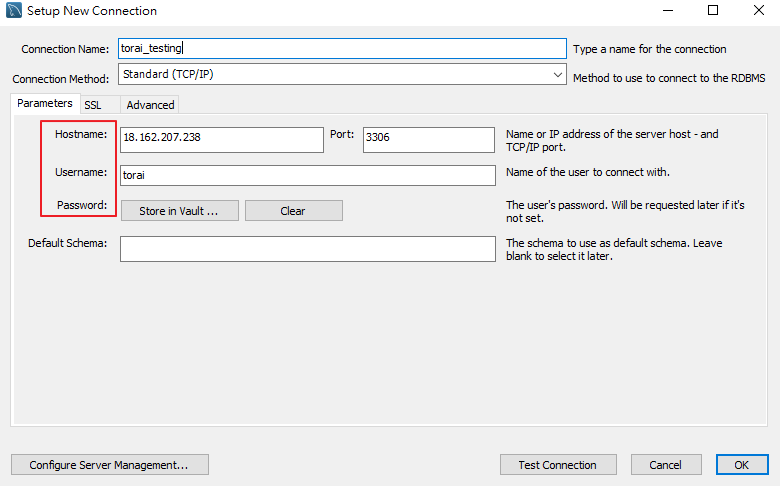

# hw2：部署

一開始遇到 AWS，我是先去官網找一些 tutorial 來跟著做，隔天再研究文件試著做跟找問題、作筆記，第三天就重新佈署並寫這篇。

AWS 蠻好玩的，也順便接觸了一下無伺服器的服務，好多新穎的服務可以玩，不過目前還沒什麼點子來應用就是。

`hw2_note.md` 裡面是散亂的隨手筆記。

這篇主要跟著 AWS 的 [教學](https://docs.aws.amazon.com/AWSEC2/latest/UserGuide/EC2_GetStarted.html#ec2-launch-instance) 走，把架設網頁的步驟和中途遇到的坑記錄下來。

## Step0. 前置作業

### create a key pair

沒什麼好講的，點進去之後把名字填完。依照你之後使用的 SSH 連線工具選擇 key_pair 的格式。我是使用 [PuTTY](https://www.chiark.greenend.org.uk/~sgtatham/putty/latest.html) 所以這邊直接勾 `.ppk`。順帶一提，PuTTY 一整包載下來，還會附帶 PuTTYgen，可以[把 `.pem` 轉成 `.ppk`](https://stackoverflow.com/questions/3190667/convert-pem-to-ppk-file-format)。

點選 Create key pair 之後，瀏覽器會自動下載私鑰，之後要用來連線到 EC2 instance 上，記得保管好。

如果作業系統是 macOS 或者 Linux 的話，要執行 `$ chmod 400 my-key-pair.pem` 設定檔案存取權限。某則會[噴錯](https://docs.aws.amazon.com/zh_tw/AWSEC2/latest/UserGuide/TroubleshootingInstancesConnecting.html#troubleshoot-unprotected-key)。

### create a security group

到 Network & Security => Security Group => create security group。

資料填一填，VPC 選預設的就好。

重點在這邊。security group 作為防火牆，會根據這邊的設定，決定底下的執行個體（EC2 instance）能不能收到/發送資料給外界。

outbound rules 預設就是全開的，可以不用動。

#### type

作為架設網頁用的伺服器，需要 SSH 以建立遠端連線，讓你從自己電腦連上去操縱虛擬機；打開 HTTP 與 HTTPS 則是使用者可以連上網頁；MySQL 是我之後想要用 mysql workbench 連上去操縱資料庫而打開。查資料時看到 [SSH tunneling/port fowrading](https://johnliu55.tw/ssh-tunnel.html)（[另一篇](http://linuxperf.com/?p=30)） 的用法，我想也可以不打開 3306 port 然後利用 SSH tunneling 把資料轉發給 3306 port 吧。

#### protocol/port range

這兩項通常都會預設好，要客製化就去 type 選 custom 的選項。

#### Source

這邊在設定哪些 IP 地址可以存取。這邊採用 [CIDR notation](https://zh.wikipedia.org/wiki/%E6%97%A0%E7%B1%BB%E5%88%AB%E5%9F%9F%E9%97%B4%E8%B7%AF%E7%94%B1)（[參考資料2](https://www.ripe.net/about-us/press-centre/understanding-ip-addressing)）。以 `203.0.113.0/24` 為例，後面 `/24` 代表子網路遮罩是 `11111111.11111111.11111111.00000000`。

`0.0.0.0/0` 代表全世界。要填入自己 IP，在下拉式選單中也能選到。如果不是固定 IP 這邊就要填入網段，例如 `114.136.0.0/16` 可代表 `114.136.0.0` ~ `114.136.255.255`。詳細說明可看[鳥哥](http://linux.vbird.org/linux_server/0110network_basic.php#tcpip_network_netmask)。

## Step1. Launch an instance

EC2 console => Instances => Instances => Launch instances 

橘色的按鈕點下去就對了。

選擇虛擬機的映像檔。這邊我選擇比較新的嗚幫土（ubuntu）。那個 x86、Arm 和 CPU 指令集有關，有興趣自己研究。

選擇虛擬機的配備，免費仔選有綠色標籤的就對啦。隨著 [region 和 zone](https://docs.aws.amazon.com/zh_tw/AWSEC2/latest/UserGuide/using-regions-availability-zones.html) 不同，免費的項目可能不一樣。

Configure Instance、Add Storage、Add Tags 這三步看名字就知道在做其他設定，因為已經有預設，新手可以先跳過這邊。

這邊選擇前置作業中創好的 security group。下面可以看到 security group 的設定。

~~如果設定得太狂野，貼心的系統會跳小視窗說，你的虛擬機會在網路上裸奔，真的可以嗎？~~

沒問題的話就按下 Review and Launch。下一頁 Review 確認完再按 Launch。

最後 Launch 前就需要設定用 SSH 連入 instance 時需要用到的 key_pair。選前置作業創的那個。

Launch 到真正啟動虛擬機需要一小段時間，可以到 instances 頁面，檢查 instance state 是不是 Running、status check 是不是 passed 來確認。

## Step2. Connect to your Linux instance

### 設定 SSH 連線

[這邊](https://docs.aws.amazon.com/AWSEC2/latest/UserGuide/AccessingInstances.html) 有官方的 SSH 連線工具指南。我之前有用過 PuTTY，毫不猶豫地選它。

[下載](https://www.chiark.greenend.org.uk/~sgtatham/putty/) 並安裝 PuTTY，打開它。

[這邊](https://docs.aws.amazon.com/AWSEC2/latest/UserGuide/connection-prereqs.html#connection-prereqs-get-info-about-instance) 有講怎麼找到下面需要的資料。

找到 public DNS資料，複製起來代替下面 `my-instance-public-dns-name` 的位置。

Host name 如果用 Public DNS 就填 `ubuntu@my-instance-public-dns-name`；用 IPv6 就填 `ubuntu@my-instance-IPv6-address`。

去 auth 把你的私鑰檔案位置放上去。

另外 Appearance 可改字體大小；Connection 可設定 keepalive 的秒數。

### 設定 SFTP 連線

SFTP, SCP, FTP, and FTPS 這幾個協定都能傳檔案到遠端的電腦，這邊使用的工具為 WinSCP，圖形介面就是簡單啦爽。

[下載](https://winscp.net/eng/download.php)、安裝、打開 WinSCP。

主機名稱填 DNS 位置、使用者名稱 ubuntu、確認 port 為 22。

記得放自己的 key。

## Step3. LAMP setting

LAMP stack：Linux、Apache、MySQL、PHP。

總之就是 web 伺服器用到的軟體包。

各種教學：[官方文件](https://docs.aws.amazon.com/AWSEC2/latest/UserGuide/ec2-lamp-amazon-linux-2.html)、[ApacheMySQLPHP](https://help.ubuntu.com/community/ApacheMySQLPHP)、[How to Install the LAMP Stack on Ubuntu 18.04](https://phoenixnap.com/kb/how-to-install-lamp-stack-on-ubuntu)

這邊提供我的步驟，以下操作都在 PuTTY：

### 安裝需要的軟體

1. `$ sudo apt update && audo apt upgrade && sudo apt dist-upgrade`： 先更新一下。如果發現無法連線，檢查 security group 的 inbound rules 有沒有把相對應的 port 打開（[apt-get update、upgrade的差別](https://askubuntu.com/questions/94102/what-is-the-difference-between-apt-get-update-and-upgrade)）。
2. `$ sudo apt-get install lamp-server^`： 安裝 lamp-server。後面有 caret 是指想要 [install package](https://askubuntu.com/questions/211912/whats-the-caret-mean-in-apt-get)。也可以用 `$ sudo apt install tasksel` 然後 `$ sudo tasksel install lamp-server` 來安裝整包。

### 設定 MySQL

讓我能在自己電腦用 mysql workbench 連上去。

採用 [How to Allow Remote Connections to MySQL](https://phoenixnap.com/kb/mysql-remote-connection) 這篇文章的步驟。

1. `$ sudo nano /etc/mysql/mysql.conf.d/mysqld.cnf`，編輯 config。
2. 選到 bind-address 那行，這裡設定我要用哪個 IP 連上 MySQL。把他註解掉或者設成 `0.0.0.0` 代表全世界都能連。應該也能設定自己所在的 IP，不過我是把它註解掉。輸入 ctrl+X > y > Enter 儲存後離開。
   
3. `$ sudo systemctl restart mysql`，重啟 mysql。
4. 文中的防火牆設定先不啟用（security group 已經初步幫我們擋了，不想搞一堆設定的話先跳過，不過可能會影響安全性就是）。我們來設定 MySQL 遠端的使用者帳密。
5. `$ sudo mysql_secure_installation`：設定與安全性相關的設定，這個設定工具透過互動式問答幫助管理者設定 root 密碼、移除匿名登入帳號、禁止 root 從遠端登入、移除測試用的資料庫。
6. `$ sudo mysql -u root`，先用 root 權限登入 MySQL。
7. 在 MySQL 裡面 `CREATE USER 'myuser'@'%' IDENTIFIED BY 'mypass';` 創帳號密碼，`%` 代表遠端連線。
8. `GRANT ALL ON *.* TO 'myuser'@'%';`：給權限。
9.  `flush privileges;`：[reload table](https://www.itread01.com/content/1542815920.html)。
10. 輸入 exit 或是 ctrl + d 離開 mysql 環境。
11. 設定好了，打開 MySQL Workbench。把 instance 的 IP 填上去，也填入剛剛設定的 myuser 與 mypass。連線囉！連不上的話，記得去 security group [打開 3306 port](https://www.ease2code.com/rds-error-2003-hy000-cant-connect-to-mysql-server-10060/)。
    
12. 利用 mysqldump 指令，將資料庫的東西[匯入/匯出](https://www.jinnsblog.com/2018/04/mysql-export-import-db-table.html)。

### Apache 設定

在安裝完 lamp-server 後，在瀏覽器輸入自己 EC2 instance 的 IP 就能看到預設的 apach 頁面，可以稍微讀一下說明。

> 這樣可以拿到自己的 IP
>
> `$ sudo apt-get install curl`
>
> `$ curl http://icanhazip.com`

可以看到他的 document roots 在 `/var/www/html`，所以只要把你的資源（網頁）利用 WinSCP 從自己電腦移到虛擬機的這個目錄底下，就能透過瀏覽器訪問。PHP 簡單示範可以看[這裡](https://phoenixnap.com/kb/how-to-install-lamp-stack-on-ubuntu#ftoc-heading-9)（沒有用 WinSCP）。

## 問題們

預設要 sudo 權限才能變更檔案，[變更使用者權限](https://askubuntu.com/questions/904850/changing-permissions-for-var-www-html) `$ sudo chown ubuntu /var/www/html` 之後就能直接操作，也就是可以直接 git clone 到 html 資料夾裡。有什麼 shell 指令不能跑，就試試在前面加上 `sudo` 吧。

如果連線到 EC2 沒有回應，第一件事檢查 security group 有沒有把相應的 port 打開。再來看作業系統裡面的防火牆設定。

[UFW cheat sheet](https://www.digitalocean.com/community/tutorials/ufw-essentials-common-firewall-rules-and-commands)，防火牆的設定。

[關閉 Auto Index](https://github.com/Lidemy/mentor-program-2nd-futianshen/issues/21)（如果文件中沒有 index 標題的檔案，會直接出現你的根目錄，要把這個功能關掉）

[Apache Virtual Host](https://httpd.apache.org/docs/2.4/en/vhosts/)，可以在一台主機上，host 多個網頁對應不同 IP；或是一個 IP 對應到不同網頁。

* `$ sudo a2dismod autoindex`
* `$ sudo systemctl restart apache2`

累了，購買網域就看別人的[文章](https://mtr04-note.coderbridge.io/2020/09/15/-%E7%B4%80%E9%8C%84-%08-%E9%83%A8%E5%B1%AC-aws-ec2-%E9%9B%B2%E7%AB%AF%E4%B8%BB%E6%A9%9F-/)、[文章2](https://nicolakacha.coderbridge.io/2020/09/16/launch-website/)。八八啦。
