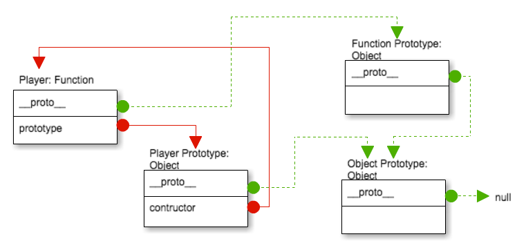
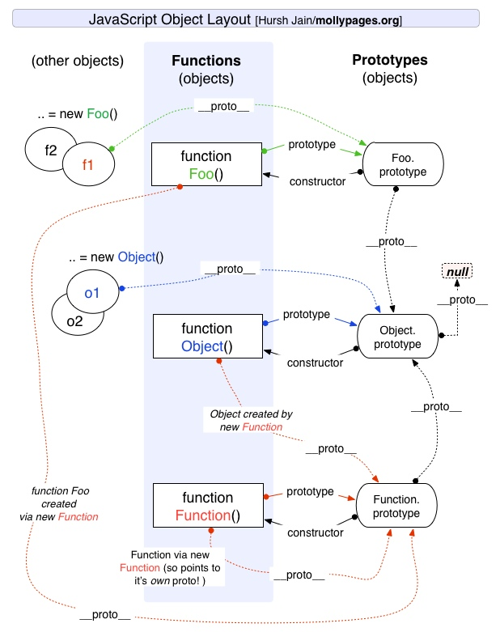

## 這週學了一大堆以前搞不懂的東西，你有變得更懂了嗎？請寫下你的心得。

有比以前懂，但很多細節還是不太清楚，應該不算真的懂。現在看到 this 就會怕怕的，不知道它到底是誰XDD

現在感覺經驗太少了比較難理解，只好先看個大概有點印象。等到以後有需要再回來複習，總會越看越熟。

花最多時間在 console 試的應該是物件導向的部分，把試到的小結論放在這裡騙版面XD。

在 [MDN](https://developer.mozilla.org/zh-TW/docs/Web/JavaScript/Reference/Global_Objects/Object/create) 上看到可以用 `Object.create() + Object.assign()` 來一次繼承多個 class：

```JavaScript
function MyClass() {
  SuperClass.call(this);
  OtherSuperClass.call(this);
}

// 繼承一個父類別
MyClass.prototype = Object.create(SuperClass.prototype);
// mixin另一個父類別
Object.assign(MyClass.prototype, OtherSuperClass.prototype);
// 重新指定建構式
MyClass.prototype.constructor = MyClass;

MyClass.prototype.myMethod = function() {
  // do a thing
};
```

`class.prototype = Object.create(superClass.prototype)`：會創一個新物件，把 `class.prototype.__proto__` 指向 `superClass.prototype`。

`Object.assign(target, source)`，則是把 source 可列舉的屬性都複製到 target。

試了一下發現 `Object.assign` 的那個 class 會沒辦法用 instanceof 來確認關係。因為 a instanceof b 是利用 `__proto__` 往上找，看 constructor 裡面有沒有 b。而 `Object.assign()` 只是單純複製可列舉屬性，沒有動到 `__proto__` ，所以從原型鏈找不到 `b`。

雖然實作上還是可以一次繼承兩個 class 的屬性，但原型鏈上只能找到其中一個，所以應該算是[沒有多重繼承](https://developer.mozilla.org/zh-TW/docs/Web/JavaScript/Guide/Details_of_the_Object_Model#%E6%B2%92%E6%9C%89%E5%A4%9A%E7%B9%BC%E6%89%BF)。

用自己的話簡單小結原型鏈：

1. 每個物件都有 `__proto__` 屬性，會指向母物件的 prototype： `child.__proto__ === parent.prototype`。例如 `const cat1 = new Cat()`，則 `cat1.__proto__ === Cat.prototype`、`cat1 instanceof Cat === true`。 
2. 每個函式都有 `prototype` 屬性，函式宣告完，初始會包含一個 `constructor` 指向自己。例如 `function Cat(name) { this.name = name }`，則 `Cat.prototype.constructor === Cat`。
3. 一個物件的內容大概會長這樣： `cat1: { privateProperties, __proto__ }`、`Cat: { privateProperties, prototype: { publicProperties, __proto__ }, __proto__ }`。這邊是我自定義，private 代表不會被繼承的屬性和方法，public 則會（通過 `__proto__` 將 `prototype` 中的屬性方法全數繼承）。`Cat.prototype.__proto__ === Object.prototype`、`Cat.__proto__ === Function.prototype`，`Cat` ：`Cat` 會把 Object 的屬性與方法傳給下一代，而自己能使用的屬性與方法來自 Function。
4. 繞圈的地方： `Object.__proto__ === Function.__proto__ === Function.prototype` 代表 Object 和 Function 都是繼承自 Function.prototype；然而 `Function.prototype.__proto__ === Object.prototype` 代表 Function.prototype 繼承自 Object.prototype。
5. 原型鏈頂端： `Object.prototype.__proto__ === null`。
6. 現在比較推薦使用有被 ECMA script 標準化的 `Object.getPorpertyOf()`。`__proto__` 則是因為相容性才做為 legacy feature 而不停用（[MDN](https://developer.mozilla.org/en-US/docs/Web/JavaScript/Reference/Global_Objects/Object/proto)）。
7. 反正 `prototype` 那包裡面是準備要給別人用的東西。別人要怎麼用？用身上的 `__proto__` 去找。

推薦的參考與圖：  
[必推：該來理解 JavaScript 的原型鍊了](https://blog.huli.tw/2017/08/27/the-javascripts-prototype-chain/)  
  
[來源：從ES6開始的JavaScript學習生活](https://eyesofkids.gitbooks.io/javascript-start-from-es6/content/part4/prototype.html?q=)
  
[來源：MollyPages.org](http://www.mollypages.org/tutorials/js.mp)  
