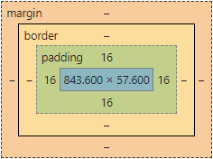

## 請找出三個課程裡面沒提到的 HTML 標籤並一一說明作用。

* `<hr>`  
  加入水平線。
* `<base herf="url" target="_self">`  
  設定 base URL，之後所有相對 URL 都會以此作為起點去找資源。位於 `<head>` 標籤之中，只能指定一個。  
  例如頁面中的 anchor：  
  1. 設定 `<base href="https://example.com">`
  2. 使用 anchor `<a href="#anchor">Anker</a>`
  3. 連結將會指向 `https://example.com/#anchor`
* `<figure>`  
  為排版中的圖表概念，而非圖片資源。其中 `<figcaption>` 為圖表的說明。
  ```html
  <figure>
    
    <figcaption>Harttle's Avatar</figcaption>
  </figure>
  ```

## 請問什麼是盒模型（box modal）

  
每個元素由內到外可分為 content、padding、border、margin，可透過操作這些屬性進行初步的網頁排版。

`box-sizing: content-box` 也就是預設的狀態下，所設定的寬高為 content 的寬高，如果再設定 padding、border 的寬度則會往外增加。  

`box-sizing: border-box` 的情況是 padding、border 會往內擠，所以寬高還是保持和當初設定的一樣。

## 請問 display: inline, block 跟 inline-block 的差別是什麼？

* inline：行內元素，可和 inline、inline-block 並排，設定 padding、margin 在垂直方向上不會影響排版（但 padding 還是會把 background 撐開），在水平方向則有效果。  

* block：區塊元素，一個元素就佔一橫排，可隨意設定寬高。

* inline-block：行內加上區塊的優點，能和 inline、inline-block 元素並排，也能隨意調整寬高。


## 請問 position: static, relative, absolute 跟 fixed 的差別是什麼？

* static：預設排版流程，由左到右、上到下的流程把元素一個一個排進版面。

* relative：還是在文件流內，不過可以設定 top、bottom、left、right，使其從定位點飄移特定距離，而不更動其他元素排版。

* absolute：脫離文件流，往上找到第一個非 static 的親代元素當作定位點，也能設定 top 等屬性作飄移。

* fixed： 脫離文件流，固定在 viewport 的特定位置。