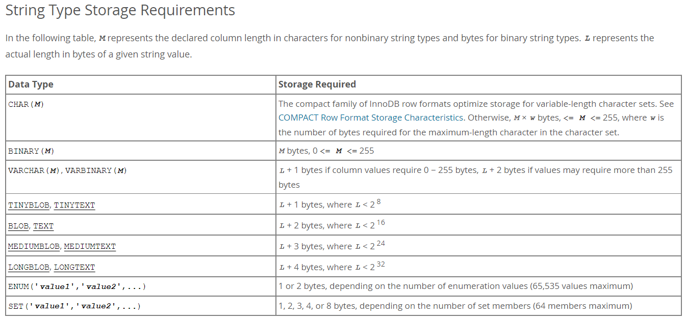

## 資料庫欄位型態 VARCHAR 跟 TEXT 的差別是什麼

`VARCHAR(M)`：

* 最多可以存 `M` 個字元。
* `M` 可以介於 0 ~ 65535 之間，不過有效長度根據使用的 charset 而不同。例如 utf8mb4 用 4 bytes 存一個字元，所以最多可以存 $`X = \frac{65535}{4} = 16383`$ 個字元。
* 儲存時，若字元小於 255 bytes 則需要額外花 1 bytes 作為 length prefix 儲存它的長度；若大於 255 bytes 則需要額外花 2 bytes 的 length prefix。
* 可以拿來當作 index 的一部分。

`Text`：

* 最多可以存 $`2^{16}-1 = 65535`$ 個字元，實際有效長度根據使用的 charset 而不同。
* 固定多花 2 bytes 作為 length prefix 來儲存值的長度。
* 不能整個資料拿來做 index，需要宣告開頭的長度才能用。
* 可以利用 `TEXT(M)` 的方式宣告長度，MySQL 會使用能夠容納 `M` 個字元的最小 TEXT Type 來建這個 column。

記得老師好像有提過，網路上搜尋也有看到說 `TEXT` 是固定長度會比 `VARCHAR` 佔容量，可是跑去看 [MySQL 文件說明](https://dev.mysql.com/doc/refman/8.0/en/storage-requirements.html#data-types-storage-reqs-strings) 好像不太一樣，文件說 `TEXT` 和 `VARCHAR` 都是可變長度，storage requirement 會根據實際的字串長度而變。

[Stack Overflow](https://stackoverflow.com/questions/25300821/difference-between-varchar-and-text-in-mysql)  
[MySQL Data Types](https://dev.mysql.com/doc/refman/8.0/en/string-type-syntax.html)

## Cookie 是什麼？在 HTTP 這一層要怎麼設定 Cookie，瀏覽器又是怎麼把 Cookie 帶去 Server 的？

一種實作 Session 的方式，能以 key: value 的形式把文字檔案存在瀏覽器中，送出 request 時瀏覽器會自動帶上這些 cookies。

Server 在 response 的時候可以帶上特定 header `Set-Cookie: <cookie-name>=<cookie-value>`，瀏覽器收到之後就會以 `<cookie-name>:<cookie-value>` 的形式儲存在瀏覽器中。  
[更多語法在這](https://developer.mozilla.org/en-US/docs/Web/HTTP/Headers/Set-Cookie)

瀏覽器在發送 request 的時候，會檢查是否有在這個 domain 之下的 cookie。若有，瀏覽器會自動以 `Cookie: name=value; name2=value2; name3=value3` 的形式帶在 request header 裡面。

## 我們本週實作的會員系統，你能夠想到什麼潛在的問題嗎？

1. 對使用者輸入的內容沒做任何檢查就存入資料庫，可能會有 XSS 或者 SQL injection 的問題。

2. 使用者密碼是用明碼形式儲存，外洩風險高。

3. 錯誤訊息是用 query string 帶在網址列（login.php），我不想給使用者亂改。

4. session id 是儲存在使用者的 cookie。如果 cookie 洩漏，駭客就能以使用者身分與伺服器互動。
